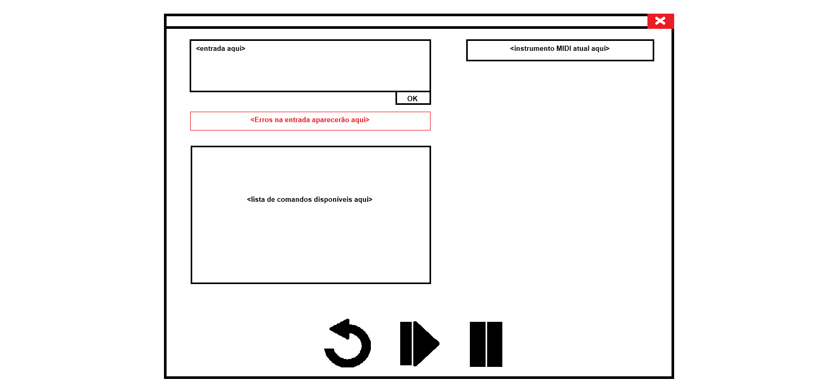

# Estudo da modularidade dos requisitos definidos na Fase 1

Matheus Luís de Castro, Kelvin Schaun Brose e Vitor Chassot.

## Descrição do programa

### Objetivo

A aplicação desenvolvida visa ser uma espécie de reprodutor de música muito simples.
o usuário entrará com uma sequência de caracteres válidos, que serão traduzidos em instruções
de som no protocolo MIDI.

### Classes e métodos previstos

#### Classe `Audio`

```python
1. class Audio(...):
2.     def __init__(self, *args, **kwargs) -> None: ...
3. 
4.     @property
5.     def current_instrument(self) -> str: ...
6.         # Nome auto explicativo.
7. 
8.     @property
9.     def current_volume(self) -> int: ...
10.         # Nome auto explicativo.
11. 
12.     @property
13.     def current_instruction(self) -> str: ...
14.         # Retorna a instrução do usuário sendo processada no momento.
15. 
16.     def set_instrument(self, instrument: str) -> None: ...
17.         # Nome auto explicativo.
18. 
19.     def set_volume(self, volume: int) -> None: ...
20.         # Nome auto explicativo.
21. 
22.     def play(self) -> None: ...
23.         # Nome auto explicativo.
24. 
25.     def restart(self) -> None: ...
26.         # Nome auto explicativo.
27. 
28.     def pause(self) -> None: ...
29.         # Nome auto explicativo.
30. 
31.     def unpause(self) -> None: ...
32.         # Nome auto explicativo.
33. 
34.     @classmethod
35.     def from_string(cls, audio_string: str) -> None: ...
36.         # Inicializa a classe a partir de uma string com caracteres válidos.
37.         # Aqui será dado como entrada a string do usuário já tratada.
38. 
39.     def _build_audio(self) -> None: ...
40.         # Itera sobre a string de entrada e constrói a a sua versão sonora.
41.         # Irá usar o método _map_char_to_midi para fazer isto.
42. 
43.     def _map_char_to_midi(self, char: str) -> int: ...
44.         # Nome auto explicativo.
```

Esta classe tem por objetivo lidar com a parte sonora da aplicação. Ela recebe como input o texto de entrada do usuário, já tratado, e mapeia cada caractere para um som usando o protocolo MIDI. Aqui também será tratada a lógica de pausar e dar play no som, porém não será aqui que o play ou o pause serão chamados a primeira vez.

#### Classe `UserInputBox`

```python
1. from .input_error import InputException
2. 
3. class UserInputBox(...):
4.     def __init__(self, *args, **kwargs) -> None: ...
5. 
6.     @property
7.     def value(self) -> str: ...
8.         # Texto contido dentro da caixa de texto.
9. 
10.     @property
11.     def is_blocked(self) -> bool: ...
12.         # Nome auto explicativo.
13. 
14.     def _validate_input(self) -> None:
15.         # Nome auto explicativo.
16.         ...
17.         raise InputException("Invalid input")
18. 
19.     def _on_ok_pressed(self) -> None: ...
20.         # Irá salvar a string, que fará a verificação do texto e envio para o mapeamento.
21. 
22.     def block(self) -> None: ...
23.         # Nome auto explicativo.
24. 
25.     def unblock(self) -> None: ...
26.         # Nome auto explicativo.
```

Esta classe tem como objetivo lidar com a caixa de texto que receberá o texto de entrada do usuário, verificar se o input é valido e "enviar" o input completo para mapeamento dos caracteres para o som.

Após a entrada de texto do usuário é necessário que o mesmo aperta um botão para verificação do texto.
A caixa de texto apenas ira receber o input do usuário quando estiver habilitada para ele.

#### Classe `InputException`

```python
1. class InputException(Exception):
2.     pass
```

Existe simplesmente para termos um erro bem definido quando o usuário entrar com um
valor errado.

\newpage

#### Classe `InputErrorBox`

```python
1. class InputErrorBox(...):
2.     def __init__(self, *args, **kwargs) -> None: ...
3. 
4.     @property
5.     def value(self) -> str: ...
6.         # Texto contido dentro da caixa de texto.
7.     
8.     def set_text(text: str) -> None: ...
9.         # Nome auto explicativo.
10.         # Método novo em relação à Fase 1 do trabalho.
11. 
12.     def display(self) -> None: ...
13.         # Mostrar o texto para o usuário.
14. 
15.     def hide(self) -> None: ...
16.         # Esconder o texto do usuário.
```

Se o usuário passar um caractere inválido na entrada, um erro será mostrado na GUI.
Esta classe irá controlar esta caixa de texto contendo o erro do usuário.

#### Classe `CommandListBox`

```python
1. class CommandListBox(...):
2.     def __init__(self, *args, **kwargs) -> None: ...
3. 
4.     @property
5.     def value(self) -> str: ...
6.         # Texto contido dentro da caixa de texto.
7. 
8.     def display(self) -> None: ...
9.         # Mostrar o texto para o usuário.
10. 
11.     def hide(self) -> None: ...
12.         # Esconder o texto do usuário.
```

Caixa de texto estática (não muda o texto), contendo uma lista de todas as entradas válidas
para o usuário.

#### Classe `MidiInstrumentBox`

```python
1. class MidiInstrumentBox(...):
2.     def __init__(self, *args, **kwargs) -> None: ...
3. 
4.     @property
5.     def value(self) -> str: ...
6.         # Texto contido dentro da caixa de texto.
7. 
8.     def set_instrument(self, instrument: str) -> None: ...
9.         # Nome auto explicativo.
10. 
11.     def display(self) -> None: ...
12.         # Mostrar o texto para o usuário.
13. 
14.     def hide(self) -> None: ...
15.         # Esconder o texto do usuário.
```

Caixa de texto para mostrar o nome do instrumento MIDI sendo tocado no momento.

\newpage

#### Classe `ControlBoard`

```python
1. class ControlBoard(...):
2.     def __init__(self, *args, **kwargs) -> None: ...
3. 
4.     @property
5.     def is_playing(self) -> bool: ...
6.         # Nome auto explicativo.
7. 
8.     def play(self) -> None: ...
9.         # Nome auto explicativo.
10. 
11.     def pause(self) -> None: ...
12.         # Nome auto explicativo.
13. 
14.     def unpause(self) -> None: ...
15.         # Nome auto explicativo.
16. 
17.     def restart(self) -> None: ...
18.         # Nome auto explicativo.
19. 
20.     def block_play(self) -> None: ...
21.         # Nome auto explicativo.
22. 
23.     def unblock_play(self) -> None: ...
24.         # Nome auto explicativo.
25. 
26.     def block_pause(self) -> None: ...
27.         # Nome auto explicativo.
28. 
29.     def unblock_pause(self) -> None: ...
30.         # Nome auto explicativo.
31. 
32.     def block_restart(self) -> None: ...
33.         # Nome auto explicativo.
34. 
35.     def unblock_restart(self) -> None: ...
36.         # Nome auto explicativo.
```

Esta classe lida com o painel de controle (botões de play, pause e restart).

\newpage

### Interface com usuário

Aqui serão explicadas os componentes da interface do usuário pré-definidos no arquivo [`fase_1/requisitos.md`](../fase_1/croqui.png)



#### Caixa de entrada de texto

É a caixa onde o usuário digitará o texto para conversão em áudio. Enquanto vazia deve aparecer o texto `insira o texto aqui`.
Conterá um botão `Ok` para o usuário verificar se não há erro no texto. Se não houver erros, a string será salva para ser mapeada para o som adequado.

#### Caixa de erro

Mostrará sé há erro no input do usuário após o botão de `Ok` ser pressionado.
Se não houver nenhum erro na entrada, informará que o texto não contém caracteres inválidos.

#### Caixa de lista de comandos

Listará mapeamento dos caracteres e suas respectivas ações. Correspondência entre texto e Notas Musicais e Ação

#### Caixa de Instrumento Atual

Caixa de texto com indicação do Instrumento atual tocando ou que iniciará tocando, quando não selecionado ou alterado pelo usuário indicará o instrumento padrão.

#### Botões

Conjunto de botões: Replay, Play e Pause. Nenhum botão estará habilitado se usuário não verificar o input no botão de verificação.
Replay: Iniciará a musica do inicio da entrada do usuário.
Play: Botão que iniciará a reprodução da musica. Ficará desabilitado quando a musica estiver tocando.
Pause: Botão que irá pausar a musica. Ficará desabilitado quando a musica NÃO estiver tocando.

## Diagrama de classes


\newpage

## Modularidade

### Critérios

- Decomponibilidade:
  - Atende o critério de decomponibilidade pois há uma clara separação de módulos, onde, por exemplo, a classe
`Audio` (ver `audio.py`) lida com uma tarefa diferente da classe `UserInputBox` (`user_input.py`),
isto é, a classe `Audio` não é acoplada com a classe `UserInputBox`, pelo menos não fortemente, pois a classe `Audio` ainda depende do input do
usuário.

- Composibilidade:
  - Não atende a composibilidade pois os códigos não podem ser livremente combinados e um cenário diferente.
  - A classe `Audio` (`audio.py`) espera, implícitamente, um tipo muito específico de string de entrada, logo
não pode _facilmente_ ser incorporada em outra aplicaço diferente desta.

- Compreensibilidade:
  - Atende este critério pois todas as variáveis são auto explicativas, e lendo apenas alguns módulos já é possivel ter uma ideia geral do software.

- Continuidade:
  - Atende o critério pois os módulos são separados os suficiente que uma pequena alteração (desde que não modifique a saída dos métodos) não afetarão
os outros módulos.

- Proteção:
  - Atende em partes este critério. A classe `UserInputBox` valida a entrada do usuário (`user_input.py:14`), e caso
a entrada possua algum erro, uma exceção é levantada (`user_input.py:17`), a qual será tratada pela classe `InputErrorBox`
(`src/input_error.py`), isto é, o erro do usuário é confinado em duas classes correlacionadas.

### Regras

- Mapeamento direto:
  - Atende a esta regra pois as classes são compatíveis com a modelagem do domínio do problema, podemos ver pela separação das classes que referenciam
pontos chaves do domínio do problema: `UserInputBox`, `InputErrorBox`, `Audio`, `ControlBoard`; assim como os métodos definidos em cada classe. Por
exemplo, as funções como `play` (`audio.py:22`), `pause`(`audio.py:28`) e `set_instrument`
(`audio.py:16`) de `Audio` refletem diretamente a necessidade de reprodução musical, uma tarefa central do programa.

- Poucas interfaces:
  - Atende pois queremos que os módulos se comuniquem com o menor número de módulos possíveis. O módulo que tem o maior número de ligações é o
`audio.py` que tem ligação com `src/control_board.py`, `src/midi.py` (que
instrumento está tocando no momento) e `user_input.py` (o áudio é a transcrição do texto do usuário). Um pouco mais que os
outros mas não ligado com todos.

- Poucas interfaces:
  - Atende pois a ligação entre os módulos se dá com a troca de poucas informações. A maior troca de informação se dará entre o modulo `midi.py` e
`audio.py`.

- Interfaces explícitas:
  - Atende em partes esta regra. A comunicação entre `UserInputBox` e `Audio` é muito explícita, pois a string de entrada do usuário é a única informação
passada entre estes módulos. A comunicação entre `UserInputBox` e `InputErrorBox` já não é tão explícita, e depende de uma exceção ser levantada na
classe `UserInputBox`.

- Ocultação da informação:
  - Apesar de Python não implementar o conceito de elementos privados, a ocultação da informação foi planejada nesta aplicação. Usamos novamente como
exemplo a classe `Audio`, onde o método `from_string` (`audio.py:35`) é público, mas o método `_build_audio`
(`audio.py:39`) é privado (começa com `_`).

### Princípios

- Unidade modular linguística:
  - Este principio visa garantir que os metodos de modularidade seja utilizado coreetamente na linguagem escolhida quando estiverem presentes nela. Para python é utilizado da seguinte maneira:
    - A modularidade é aplicada organizando o código em arquivos `.py` (ou pacotes) e também em objetos (classes e funções), garantido que cada módulo seja independente.
    - Escopo e proteção de erros. Cada modulo possui seu próprio escopo, utilizando variáveis locais em funções e também algumas funções internas
    estão marcadas com `_` para indicar uso privado. como `_validate_input` em `user_input.py:14`.
  - Então atende ao primeiro princípio.

- Auto documentação:
  - Todos os métodos e propriedades foram pensados de maneira a terem nomes claros e intuitivos. Além disso, os nomes das classes já fornecem um bom indício de quais responsabilidades e comportamentos são atribuídos a elas.

- Acesso uniforme:
  - Todos os módulos possuem a mesma sintaxe para a mesma ação. Além disso, Em Python, o decorador @property permite que métodos sejam acessados como se fossem atributos. Isso cria uma camada de abstração, onde um método que realiza cálculos ou acessa dados externos pode ser chamado da mesma maneira que um atributo simples.

- Aberto-fechado:
  - Pelos módulos já estarem devidamente separados e bem estruturados é possivel expandir para futuras extensões.

- Escolha única:
  - Os modulos do programa satisfazem o principio da escolha única, pois existem métodos bem definidos tanto para inserir ou obter informações em um dado objeto de uma classe, quanto para fazer tarefas específicas. Por exemplo, a classe `Audio` possui métodos `set_instrument` (`audio.py:16`) e `set_volume` (`audio.py:19`) para configurar o instrumento e o volume, e propriedades como `current_instrument` (`audio.py:5`) e `current_volume` (`audio.py:9`) para recuperar esses valores. Com isso, todas as operações de configuração e recuperação de dados de áudio são centralizadas nessa classe.

## Proposta de Solução

- Composibilidade:
  - Para atender melhor o critério de composibilidade, no exemplo citado do código, em que a classe `Audio` espera, implícitamente, um tipo muito específico de string de entrada, poderiamos retirar esta necessidade de receber uma string específica se a string em questão estivesse no mesmo módulo, mas se esta alteração for implementada, teríamos um "super módulo", o que afetaria inversamente o critério da Decomponibilidade,
