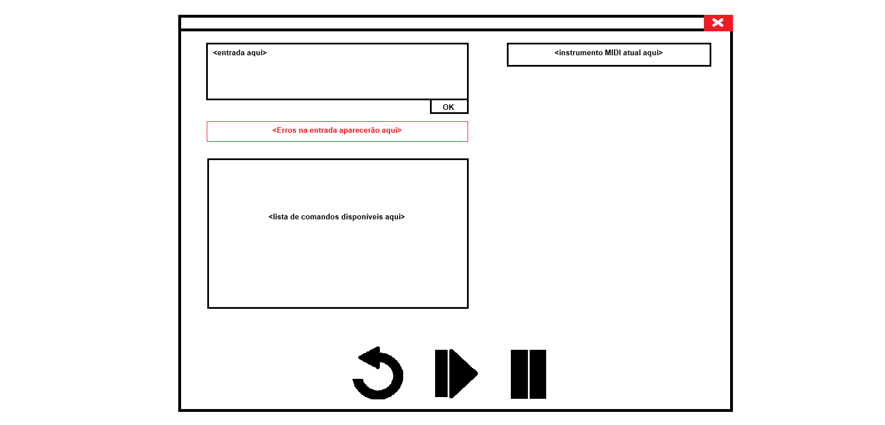
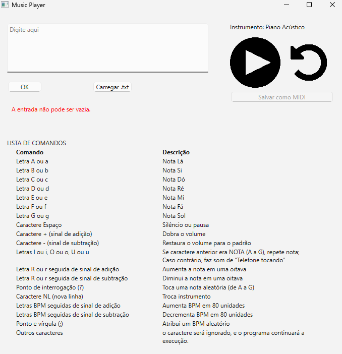
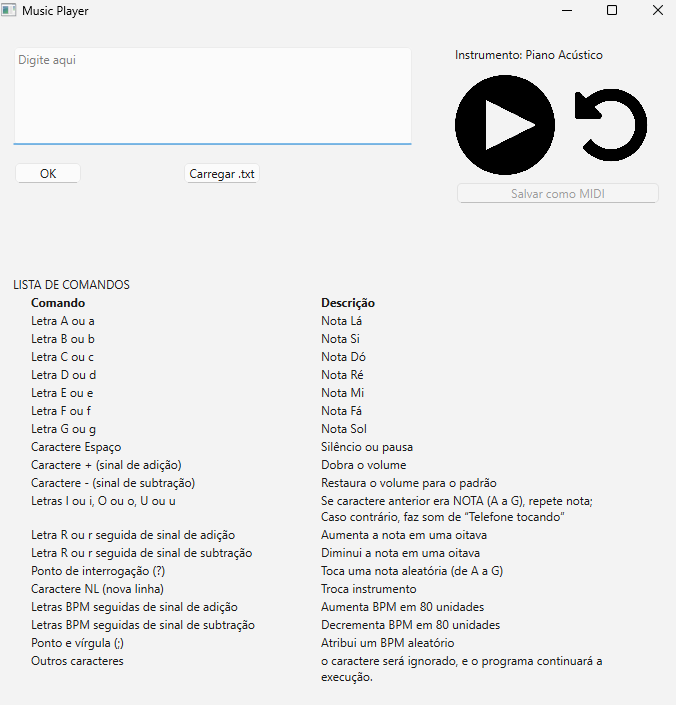

# Fase 3

Integrantes: Kelvin Schaun Brose, Matheus Luís de Castro e Vitor Chassot.

## Mudanças em relação às Fases 1 e 2

## Proposta Inicial (Fase 1)

### Visível ao usuário

O(a) usuário(a) irá digitar uma sequência de caracteres em uma caixa de texto. Após isso, irá
apertar play, e a música irá tocar. Ele(a) poderá pausar a música a qualquer instante.

- Caixa de texto para o usuário digitar o comando desejado com um botão de `Ok` para finalizar input;
- Uma lista dos comandos aceitos pelo programa;
- Um texto (ou marcador) para mostrar a nota sendo tocada no momento;
- Botão ou tecla de play;
- Botão ou tecla de pause;
- Botão ou tecla de reiniciar;
- Sinalização de erros no texto de entrada;
- Bloquear a caixa de texto durante a execução da música;
- Bloquear a caixa de texto durante o pause;
- Sinalizar o instrumento MIDI atual;
- Sinalizar que a música está tocando;
- Quando a música acaba, se o usuário clicar play, volta do início;

### Para os desenvolvedores

- Definir tempo de duração de cada nota;
- Definir um instrumento MIDI default;
- Implementar a lógica para bloquear e desbloquear os botões de controle (Play, Pause, Reiniciar) em diferentes estados do programa (por exemplo, bloquear "Play" durante a execução da música e desbloquear "Pause");
- Otimizar o uso de recursos para garantir que a música toque sem interrupções ou travamentos;

## Modificações de especificação

- Caixa de texto para o usuário digitar o comando desejado com um botão de `Ok` para finalizar input;
  - \color{teal}{Este requisito foi implementado sem modificações.}
- Uma lista dos comandos aceitos pelo programa;
  - \color{teal}{Não ouve mudança nesta especificação, apenas no conteudo do texto}.
- Um texto (ou marcador) para mostrar a nota sendo tocada no momento;
  - \color{purple}{Esta especificação foi removida, pois notamos que algumas notas, dependendo da velocidade, iriam atualizar muito rapidamente, perdendo sentido de tentar acompanhar todas as mudanças, dando uma sobrecarga visual.}
- Botão ou tecla de play;
  - \color{orange}{Este requisito foi modificado, feita a união com o botão pause.}
- Botão ou tecla de pause;
  - \color{orange}{Este requisito foi modificado, feita a união com o botão play.}
- Botão ou tecla de reiniciar;
  - \color{teal}{Este requisito foi implementado sem modificações.}
- Sinalização de erros no texto de entrada;
  - \color{teal}{Este requisito foi implementado sem modificações.}
- Bloquear a caixa de texto durante a execução da música;
  - \color{teal}{Este requisito foi implementado sem modificações.}
- Bloquear a caixa de texto durante o pause;
  - \color{purple}{Escolhemos não implementar esta opção na Fase 3, pois chegamos a conclusão que não faria sentido tal regra.}
- Sinalizar o instrumento MIDI atual;
  - \color{teal}{Este requisito foi implementado sem modificações.}
- Sinalizar que a música está tocando;
  - \color{orange}{A sinalização de que a música começou é a mudança do botão de play para o botão de pause.}
- Quando a música acaba, se o usuário clicar play, volta do início;
  - \color{orange}{Modificamos esta regra para a música voltar ao início automaticamente.}

### Adições de requisitos

- Usuário pode carregar um arquivo de texto;
- Botão de `Salvar como MIDI`;
- O botão de `Salvar como MIDI` deve ficar desabilitaddo até o usuario der a primeira verificação de input sem erro;
- Usuário pode salvar o input em um arquivo `.mid`

## Planejamento inicial da interface $\times$ Interface final do usuário

Na Figura \ref{croqui} temos o croqui da interface do usuário. A idéia inicial é que os botões de play, pause e reiniciar, ficassem em baixo pela familiaridade de programas tradicionais de tocadores de música. A lista de comandos ficaria logo abaixo da entrada de texto para ficar próxima, facilitando o acompanhamento durante a inserção do texto.



{ width=50% }

{ width=50% }

Nas Figuras \ref{gui_error_box} e \ref{gui} temos a interface final do usuário (com e sem erro de input). O layout do programa se manteve muito próximo do planejado no croqui apenas adicionando os botões na nova requisição, feito a fusão do botão play e pause.
Foi modificado também a localização dos componentes para uma melhorar organização visual, deixando seu visual mais equilibrado, e os elementos foram reposicionados, deixando botões mais frequentemente utilizados próximos, garantindo a facilidade de uso do programa.

\newpage

## Classes e métodos

### Classes relacionadas ao input do usuário

A classe `UserInputBox` da Fase 1, foi dividida em 3 partes na Fase 3: `UserInputWidget`, `TxtLoaderWidget` e `InputValidator`; porém, a classe `InputErrorBox` se manteve a mesma.

A nova organização das classes relacionadas ao input foi:

#### `UserInputWidget`

```python
class UserInputWidget(QtWidgets.QWidget):
    value_changed = pyqtSignal(str)  # Atributo público que sinaliza para um objeto
                                     # externo que o usuário inseriu um input válido

    def __init__(self) -> None:
        super().__init__()

        self._layout = QtWidgets.QGridLayout()

        self._input = QtWidgets.QTextEdit()
        self._ok_button = QtWidgets.QPushButton("OK")
        self._txt_loader = TxtLoaderWidget()
        self._error_box = InputErrorBox()

        self._value: Optional[str] = None
        self._is_valid: Optional[bool] = None
        self._is_blocked = False

    @property
    def value(self) -> Optional[str]:
        # Atributo público que devolve o valor do atributo privado '_value'.
        # Este atributo carrega a string na caixa de texto.

    @property
    def is_blocked(self) -> bool:
        # Atributo público que devolve o valor do atributo privado '_is_blocked'.

    @property
    def is_valid(self) -> Optional[bool]:
        # Atributo público que devolve o valor do atributo privado '_is_valid'.

    def block(self) -> None:
        # Bloqueia qualquer forma de input do usuário.

    def unblock(self) -> None:
        # Desbloqueia todas as formas de input do usuário.

    def _validate_input(self) -> None:
        # Chama InputValidator para validar a string na caixa de texto.

    def _show_error(self, e: InputException) -> None:
        # Nome autoexplicativo.

    def _on_ok_pressed(self) -> None:
        # Callback para quando o botão 'OK' é pressionado pelo usuário.
        # Aqui é chamada a função de validação.

    def _on_file_loaded(self) -> None:
        # Callback para quando o botão de 'Carregar .txt' é pressionado pelo usuário.
        # Carrega o texto do arquivo na caixa de texto.
```

#### `InputErrorBox` e `InputException`

```python
class InputErrorBox(QtWidgets.QWidget):
    def __init__(self) -> None:
        super().__init__()

        self._layout = QtWidgets.QHBoxLayout()
        self._error_label = QtWidgets.QLabel()

        self._value: Optional[str] = None

    @property
    def value(self) -> Optional[str]:
        # Atributo público que devolve o valor do atributo privado '_value'.
        # Carrega a mensagem de erro.

    def set_text(self, text: str) -> None:
        # Nome autoexplicativo.

    def display(self) -> None:
        # Nome autoexplicativo.

    def hide(self) -> None:
        # Limpa e esconde a caixa de erro.


class InputException(Exception):
    pass
    # Apenas uma exceção com um nome mais adequado para os nossos propósitos.
```

#### `TxtLoader`

```python
class TxtLoaderWidget(QtWidgets.QWidget):
    file_loaded = pyqtSignal(str)  # Atributo público que sinaliza para um objeto
                                   # externo que o arquivo foi carregado com sucesso.

    def __init__(self) -> None:
        super().__init__()

        self._layout = QtWidgets.QHBoxLayout()
        self._load_button = QtWidgets.QPushButton("Carregar .txt")

        self._value = ""

    @property
    def value(self) -> str:
        # Atributo público que devolve o valor do atributo privado '_value'.
        # Carrega a string do arquivo de texto.

    def _on_load_pressed(self) -> None:
        # Callback para quando o usuário clica no botão de 'Carregar .txt'.
        # Abre o explorador de arquivos para o usuário carregar o arquivo desejado.
```

#### `InputValidator`

```python
class InputValidator:
    # Mensagens de erros salvas em constantes públicas.
    EMPTY_INPUT_ERROR_MESSAGE = ...
    NO_MANDATORY_COMMAND_ERROR_MESSAGE = ...

    @staticmethod
    def _has_at_least_one_mandatory_command_defined(input_str: str) -> bool:
        # Checa se a entrada não é vazia e se contém pelo menos 1 nota
        # ou comando de repetição.

    @classmethod
    def validate(cls, input_str: str) -> None:
        # Valida se a entrada não é vazia e se contém pelo menos 1 nota
        # ou comando de repetição. Chama o método privado acima. Se a string
        # não for válida, 'InputException' é erguida.
```

### Classes relacionadas ao áudio

A classe `Audio` ficou consideravelmente maior e mais complexa devido ao fato de termos que lidar com threads.

#### `Audio`

```python
class Audio(QThread):
    # Constantes privadas para evitar o uso de 'números mágicos'.
    _DEFAULT_VOLUME = ...
    _DEFAULT_OCTAVE = ...
    _MAX_VOLUME = ...
    _MAX_OCTAVE = ...
    _MIN_OCTAVE = -...
    _DEFAULT_BPM = ...
    _MAX_BPM = ...
    _DEFAULT_INSTRUMENT = ...

    instrument_changed = pyqtSignal(int)  # Atributo público que sinaliza para um objeto
                                          # externo que o instrumento mudou.

    def __init__(self, sequence: Optional[list[str]] = None) -> None:
        super().__init__()

        self._sequence = sequence
        self._processed_sequence = list()

        self._midi_player: Optional[pygame.midi.Output] = None

        self._current_instrument = self._DEFAULT_INSTRUMENT
        self._current_volume = self._DEFAULT_VOLUME
        self._current_octave = self._DEFAULT_OCTAVE
        self._current_bpm = self._DEFAULT_BPM
        self._note_duration_sec = _bpm_to_period(self._DEFAULT_BPM)

        self._previous_note: Optional[str] = None
        self._current_note: Optional[str] = None
        self._previous_instruction_index: Optional[int] = None
        self._current_instruction_index = 0

        self._should_play = False

    @property
    def current_instrument(self) -> int:
        # Atributo público que devolve o valor do atributo
        # privado '_current_instrument'.
      
    @property
    def current_volume(self) -> int:
        # Atributo público que devolve o valor do atributo
        # privado '_current_volume'.

    @property
    def current_octave(self) -> int:
        # Atributo público que devolve o valor do atributo
        # privado '_current_octave'.

    @property
    def current_instruction(self) -> Optional[int]:
        # Atributo público que devolve o valor do atributo
        # privado '_current_instruction_index'.

    @property
    def should_play(self) -> bool:
        # Atributo público que devolve o valor do atributo
        # privado '_shoud_play'.

    def set_should_play(self, v: bool) -> None:
        # Nome autoexplicativo.

    def set_instrument(self, instrument: int) -> None:
        # Nome autoexplicativo.

    def set_volume(self, volume: int) -> None:
        # Nome autoexplicativo.

    def inc_volume(self, inc: int) -> None:
        # Nome autoexplicativo.

    def dec_volume(self, dec: int) -> None:
        # Nome autoexplicativo.

    def set_octave(self, octave: int) -> None:
        # Nome autoexplicativo.

    def inc_octave(self, inc: int) -> None:
        # Nome autoexplicativo.

    def dec_octave(self, dec: int) -> None:
        # Nome autoexplicativo.

    def set_bpm(self, v: int) -> None:
        # Nome autoexplicativo.

    def inc_bpm(self, inc: int) -> None:
        # Nome autoexplicativo.

    def dec_bpm(self, dec: int) -> None:
        # Nome autoexplicativo.

    def run(self) -> None:
        # Este método é herdado da classe 'QThread', e é aqui que
        # acontece o loop principal da thread.

    def play(self) -> None:
        # Inicializa a thread que irá tocar a música.

    def restart(self) -> None:
        # Nome autoexplicativo.

    def pause(self) -> None:
        # Nome autoexplicativo.

    def set_sequence(self, audio_string: str) -> None:
        # Alimenta esta classe com a string de input do usuário.

    def _process_sequence_into_list_of_commands(self) -> None:
        # Nome autoexplicativo.

    def _get_previous_command(self) -> Optional[str]:
        # Nome autoexplicativo.

    def _handle_mandatory_command(
        self, command: str, prev_command: Optional[str]
    ) -> None:
        # Lida com as notas e os comandos de repetição.

    def _map_command_char_to_midi(self, char: str) -> int:
        # Mapeia notas para o seu MIDI ID.

    def _make_telephone_ring(self) -> None:
        # Nome autoexplicativo.

    def _play_note(self, note: int) -> None:
        # Nome autoexplicativo.

    def _run_config_command(self, command: str) -> None:
        # Lida com caracteres/palavras que não são notas nem comandos de repetição.

def _bpm_to_period(f: int) -> float:
    # Função que converte BPM para um tempo em segundos.
```

### Classes relacionadas à lista de comandos

A classe que lida com a listagem dos comandos disponíveis, `CommandListBoox`, foi alterada de maneira a ser uma classe estática (nunca é alterada).

#### `CommandListBox`

```python
class CommandListBox(QtWidgets.QWidget):
    def __init__(self) -> None:
        super().__init__()

        self._layout = QtWidgets.QVBoxLayout()

        self._text = QtWidgets.QLabel()

    def display(self) -> None:
        # Nome autoexplicativo.

    @staticmethod
    def _commands_explanation_as_list(col_separator: str) -> list[list[str]]:
        # Traduz a explicação dos comandos na classe Commands em uma
        # estrutura de lista de listas para ser feita uma tabela.

    def _commands_explanation_to_html(self, col_separator: str = ":") -> str:
        # Usando o método acima, traduz a lista de listas para uma
        # tabela HTML que o usuário conseguirá ver.
```

#### `Commands`

```python
class Commands(StrEnum):
    # Enumeração dos comandos disponíveis.
    NOTE_LA = ...
    NOTE_SI = ...
    NOTE_DO = ...
    NOTE_RE = ...
    NOTE_MI = ...
    NOTE_FA = ...
    NOTE_SOL = ...
    RANDOM_NOTE = ...

    REPEAT_NOTE_OR_CELL_RING_TONE_CHAR_1 = ...
    REPEAT_NOTE_OR_CELL_RING_TONE_CHAR_2 = ...
    REPEAT_NOTE_OR_CELL_RING_TONE_CHAR_3 = ...

    INC_1_OCTAVE = ...
    DEC_1_OCTAVE = ...
    INC_BPM_80_UNITS = ...
    DEC_BPM_80_UNITS = ...
    RANDOM_BPM = ...

    SILENCE = ...
    CHANGE_INSTRUMENT = ...
    DOUBLE_VOLUME = ...
    RESET_VOLUME = ...

    @staticmethod
    def explanation() -> str:
        # Texto bem padronizado que explica cada comando.

    @classmethod
    def notes(cls) -> list["Commands"]:
        # Lista os comandos de notas.

    @classmethod
    def repeat_commands(cls) -> list["Commands"]:
        # Lista os comandos de repetição.

    @classmethod
    def mandatory(cls) -> list["Commands"]:
        # Lista os comandos de notas e de repetição.
```

### Classes relacionadas aos painel de controle

O painel de controle foi simplificado, de maneira que o processo de bloqueamento e desbloqueamento de botões foi unificado em um único método.

A classe `ControlBoard` também não desempenha nenhuma ação concreta em relação às ações de play, pause, restart e salvar, ela apenas _sinaliza_ que o usuário clicou nestes botões.

#### `PlayPauseButton` , `RestartButton` e `ControlBoard`

```python
# Classe que define o botão de play/pause.
class PlayPauseButton(QtWidgets.QAbstractButton):
    def __init__(self) -> None:
        super().__init__()

        self._play_image = QtGui.QPixmap("src/images/play.png").scaled(
            QtCore.QSize(100, 100)
        )
        self._pause_image = QtGui.QPixmap("src/images/pause.png").scaled(
            QtCore.QSize(100, 100)
        )

        self._icon = self._play_image

    def toggle_icon(self) -> None:
      # Atualiza a imagem do botão quando ele for clicado.

    def sizeHint(self) -> QtCore.QSize:
      # Aplica o tamanho da imagem.
      # Método herdado de 'QtWidgets.QAbstractButton'.

    def paintEvent(self, e: Optional[QtGui.QPaintEvent]) -> None:
      # Configura como o botão é desenhado.
      # Método herdado de 'QtWidgets.QAbstractButton'.

# Classe que define o botão de restart.
class RestartButton(QtWidgets.QAbstractButton):
    def __init__(self) -> None:
        super().__init__()

        self._image = QtGui.QPixmap("src/images/restart.png").scaled(
            QtCore.QSize(100, 100)
        )
        self._image_blocked = QtGui.QPixmap("src/images/restart_blocked.png").scaled(
            QtCore.QSize(100, 100)
        )

        self._icon = self._image
        self._is_blocked = False

    @property
    def is_blocked(self) -> bool:
        # Atributo público que devolve o valor do atributo
        # privado '_is_blocked'.
      
    def block(self) -> None:
        # Nome autoexplicativo.

    def unblock(self) -> None:
        # Nome autoexplicativo.

    def sizeHint(self) -> QtCore.QSize:
      # Aplica o tamanho da imagem.
      # Método herdado de 'QtWidgets.QAbstractButton'.

    def paintEvent(self, e: Optional[QtGui.QPaintEvent]) -> None:
      # Configura como o botão é desenhado.
      # Método herdado de 'QtWidgets.QAbstractButton'.


class ControlBoard(QtWidgets.QWidget):
    play = QtCore.pyqtSignal()  # Atributo público que sinaliza para um objeto
                                # externo que o usuário clicou em 'play'.
    pause = QtCore.pyqtSignal()  # Atributo público que sinaliza para um objeto
                                # externo que o usuário clicou em 'pause'.
    restart = QtCore.pyqtSignal()  # Atributo público que sinaliza para um objeto
                                # externo que o usuário clicou em 'restart'.
    save = QtCore.pyqtSignal()  # Atributo público que sinaliza para um objeto
                                # externo que o usuário clicou em 'Salvar como MIDI'.

    def __init__(self) -> None:
        super().__init__()

        self._layout = QtWidgets.QVBoxLayout(self)

        self._play_pause_button = PlayPauseButton()
        self._restart_button = RestartButton()
        self._save_midi_button = QtWidgets.QPushButton("Salvar como MIDI")

        button_layout = QtWidgets.QHBoxLayout()

        self._is_playing = False

    @property
    def is_playing(self) -> bool:
        # Atributo público que devolve o valor do atributo
        # privado '_is_playing'.

    def block_save_button(self) -> None:
        # Nome autoexplicativo.

    def unblock_save_button(self) -> None:
        # Nome autoexplicativo.

    def _on_play_pause_button_clicked(self) -> None:
        # Callback para quando o usuário clica em 'play' ou 'pause'.

    def _on_restart_button_clicked(self) -> None:
        # Callback para quando o usuário clica em 'restart'.

    def _on_save_as_midi_clicked(self):
        # Callback para quando o usuário clica em 'Salvar como MIDI'.

    def to_play_state(self) -> None:
        # Callback para quando a música acabar, o botão voltar ao estado de 'play'.

```

### Classes relacionadas ao processamento para o arquivo MIDI

#### `MidiFileProcessor`

```python
class MidiFileProcessor:
    # Valores configurados como padrão inicial
    _DEFAULT_VOLUME = ...
    _DEFAULT_OCTAVE = ...
    _MAX_VOLUME = ...
    _MAX_OCTAVE = ...
    _MIN_OCTAVE = -...
    _DEFAULT_BPM = ...
    _MAX_BPM = ...
    _DEFAULT_INSTRUMENT = ...

    def __init__(self):
        self.midi_file = mido.MidiFile()
        self.ticks_per_beat = self.midi_file.ticks_per_beat

        self.track = mido.MidiTrack()

        self.bpm = self._DEFAULT_BPM
        self.octave = self._DEFAULT_OCTAVE
        self.instrument = self._DEFAULT_INSTRUMENT
        self.note_duration = self.ticks_per_beat
        self.volume = self._DEFAULT_VOLUME

    def convert_user_input_to_midi(self, user_input: str, parent_widget=None):
      # Recebe o user_input do UserInputWidget, checa se o valor não é nulo, 
      # e faz a varredura por caractere do input do usuário usando o enum
      # Commands como referência.

    @property
    def char_to_midi(self):
      # Lista de notas para seu valor em midi usando como padrão a 4a oitava.

    def _adjust_bpm(self, user_input, index, bpm, increase=True):
      # Nome autoexplicativo.

    def _process_note(self, char_to_midi, char):
      # Processa notas através de eventos midi de nota_on e nota_off

    def _process_pause(self):
      # Nome autoexplicativo.

    def _process_instrument_change(self, user_input, index, char_to_midi):
      # Nome autoexplicativo.

    def _process_new_line(self):
      # Nome autoexplicativo.

    def _save_midi_file(self, parent_widget):
      # Nome autoexplicativo.
```

### Classes relacionadas à exibição do instrumento sendo tocado

#### `MidiInstrumentBox`

```python
class MidiInstrumentBox(QWidget):
    def __init__(self):
        super().__init__()
        layout = QVBoxLayout(self)
        self.instrument_label = QLabel()

        self.instrument_names = self._get_instrument_names()

    def set_instrument(self, instrument: int):
      # Atualiza intrumento na GUI.

    def _get_instrument_names(self):
      # Lista de instrumentos midi de 0 a 127.
```

### Classes relacionadas ao GUI

A classe `MusicPlayer` é a classe principal, dado que é nela que ocorrem as trocas de informação entre os outros objetos listados acima, por meio de _callbacks_ e _sinais_.

#### `MusicPlayer`

```python
class MusicPlayer(QtWidgets.QWidget):
    def __init__(self):
        super().__init__()

        self._layout = QtWidgets.QGridLayout(self)

        self._command_list_box = CommandListBox()

        self._user_input_widget = UserInputWidget()
        self._audio_manager = Audio()
        self._midi_processor = MidiFileProcessor()
        self._midi_instrument_box = MidiInstrumentBox()
        self._control_board_widget = ControlBoard()

    def _feed_string(self) -> None:
        # Callback para quando o usuário clicar em 'OK'.
        # Este método passa a string para 'Audio' e 'MidiFileProcessor'

    def _on_play_clicked(self) -> None:
        # Callback para quanndo o usuário clica em 'play'.

    def _on_music_ended(self) -> None:
        # Callback para quando a música chega ao fim.

    def _save(self) -> None:
        # Callback para quando o usuário clica em 'Salvar como MIDI'.
```

## Casos de Testes

Para casos de testes foram utilizados procedimentos tanto automáticos quantos manuais. Para os procedimentos automáticos se utilizou a biblioteca `pytest`. Para testes de funcionalidade do programa, saída de áudio e salvamento de arquivo MIDI foram utilizados procedimentos manuais.

### Testes Automáticos

Este projeto contou com um processo de _integração contínua_ (Continuous Integration, ou CI) hospedado em um repositório GitHub. Para cada _push_ para a branch `main`, ou qualquer pull request com alvo esta mesma branch, este CI seria rodado automaticamente.

Estão presentes neste CI:

- Checagem da formatação do código;
- Checagem das regras de _linting_;
- Checagem dos testes unitários implementados anteriormente na base de código.

Se qualquer um desses testes falhasse, o workflow era cancelado, e o processo de _merge_ era bloqueado até que o desenvolvedor corrigisse os erros e todas as checagens passasem sem erros. Abaixo é possível ver o arquivo de configuração do workflow.

```yml
name: Continuous Integration
on:
  push:
    branches: [main]

  pull_request:
    branches: [main]

jobs:
  check_formatting_linting_and_unit_tests:
    name: Check Formatting, Linting and Unit Tests
    runs-on: ubuntu-latest

    container:
      image: mldc/tcp:latest
      volumes:
        - ${{ github.workspace }}:/tcp

    env:
      working-directory: /tcp

    steps:
      - uses: 'actions/checkout@v4'

      - name: Check Formatting
        run: poetry run ruff format --check src
        working-directory: ${{ env.working-directory }}

      - name: Check Linting
        run: poetry run ruff check src
        working-directory: ${{ env.working-directory }}

      - name: Unit Tests
        run: poetry run pytest -v src
        working-directory: ${{ env.working-directory }}
```

### Testes Manuais

Os testes manuais foram focados em pontos específicos da lista de comandos:

- Testes auditivos se as notas estão corretas;
- Se o incremento e decremento de oitavas condiz com sua sonoridade;
- O elemento de pausa está presente entre notas;
- Se os valores de aumento de velocidade, oitavas e volume não ultrapassa o limite máximo ou mínimo (teste de fronteiras);
- Se os valores estão sendo resetados corretamente;
- Testes de casos específicos como repetição da nota ou o tocar do telefone para as letras 'i', 'o' e 'u', procurando obter ambas variações.
